# 📝 LiveDocs - Collaborative Workspace Engine

### Real-Time Document Editor with Recursive Nesting & Optimistic Sync


---

## 🚀 Project Overview

**LiveDocs** is a production-grade collaborative workspace engine engineered to handle real-time rich text editing, infinite document nesting, and role-based access control. 

Unlike standard CRUD applications, LiveDocs implements an **event-driven architecture** using Firebase Firestore listeners to synchronize state across multiple clients with sub-100ms latency, ensuring a seamless "multiplayer" editing experience similar to Notion or Google Docs.

---

# 🛠️ Engineering Deep Dive

## System Architecture

The system utilizes a **serverless architecture** to handle scaling and real-time connections. State changes are propagated via Firestore snapshots, while the UI relies on optimistic updates to ensure zero-latency interactivity.

```mermaid
flowchart TB
    subgraph Client ["🖥️ Client (Next.js 14)"]
        UI[Rich Text Editor UI]
        LocalState[Optimistic State]
        Auth_C[Clerk Auth SDK]
    end

    subgraph Backend ["☁️ Managed Services"]
        Fire_DB[(Firebase Firestore)]
        Fire_Live[Real-Time Listeners]
        Clerk_S[Clerk Auth Server]
    end

    %% Auth Flow
    Auth_C -->|Authenticate| Clerk_S
    Clerk_S -->|Verify Token| Fire_DB

    %% Write Flow
    UI -->|User Types| LocalState
    LocalState -->|Immediate Render| UI
    LocalState -->|Async Write| Fire_DB

    %% Read/Sync Flow
    Fire_DB -->|Doc Change Event| Fire_Live
    Fire_Live -->|Push Snapshot| LocalState
    LocalState -->|Reconcile & Update| UI

```



---

## 🧩 Technical Challenges Solved

### Challenge 1: Recursive Document Routing & Nesting

**The Problem:** Notion-style documents allow infinite nesting (A Page inside a Page inside a Page). Standard file-based routing cannot handle arbitrary depth.
**The Solution:**

* Implemented a **dynamic catch-all route strategy** (`/documents/[...documentId]`) in the Next.js App Router.
* Engineered a recursive component tree that fetches child references lazily, preventing "waterfall" loading states while maintaining the hierarchical structure.

### Challenge 2: Real-Time Latency & Optimistic UI

**The Problem:** Waiting for a server round-trip (RTT) for every keystroke makes the editor feel sluggish.
**The Solution:**

* **Optimistic Updates:** The UI updates the local state *immediately* upon user input, while the database write happens asynchronously in the background.
* **Debounced Writes:** High-frequency input is batched to prevent database rate-limiting while maintaining the illusion of instant sync.

### Challenge 3: Granular Role-Based Access Control (RBAC)

**The Problem:** Managing permissions for "Private" vs "Public" workspaces while allowing guest access.
**The Solution:**

* Integrated **Custom Claims** within the Auth payload to define strict roles (`Owner`, `Editor`, `Viewer`).
* Implemented middleware barriers that verify document ownership at the edge before serving the page content, ensuring zero data leakage.

---

## 📚 The Stack: Why Each Technology?

| Technology | Purpose | Engineering Justification |
| --- | --- | --- |
| **Next.js 14 (App Router)** | Framework | leveraged Server Components (RSC) for initial document load performance and SEO. |
| **Firebase Firestore** | Database & Sync | Chosen for its native WebSocket-based `onSnapshot` listeners which handle the heavy lifting of real-time pub/sub. |
| **Clerk** | Authentication | Offloaded complex session management and MFA security to a dedicated identity provider. |
| **Tailwind + Shadcn/UI** | Design System | rigorous consistency and accessibility (a11y) standards out of the box. |
| **TypeScript** | Type Safety | Enforced strict typing for document models to prevent runtime errors during state synchronization. |

---

## 🚀 Getting Started

### Prerequisites

* Node.js v18+
* npm or yarn

### 1. Clone & Install

```bash
git clone [https://github.com/sairishigangarapu/LiveDocs.git](https://github.com/sairishigangarapu/LiveDocs.git)
cd LiveDocs
npm install

```

### 2. Environment Setup

Create a `.env.local` file in the root:

```bash
NEXT_PUBLIC_CLERK_PUBLISHABLE_KEY=pk_test_...
CLERK_SECRET_KEY=sk_test_...

NEXT_PUBLIC_FIREBASE_API_KEY=...
NEXT_PUBLIC_FIREBASE_AUTH_DOMAIN=...
NEXT_PUBLIC_FIREBASE_PROJECT_ID=...

```

### 3. Run Development Server

```bash
npm run dev

```

Visit `http://localhost:3000` to start editing.

---

## 📄 License

This project is open-source and available under the [MIT License](https://www.google.com/search?q=LICENSE).


**Author:** [Sai Rishi Gangarapu](https://github.com/sairishigangarapu)

```

